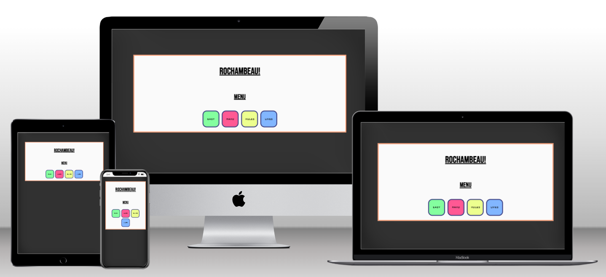
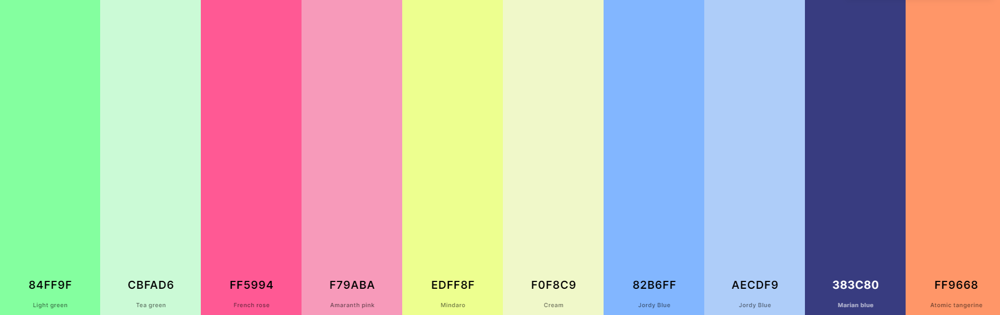
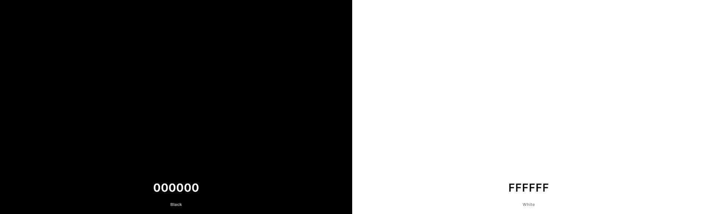

# ***ROCHAMBEAU!***

## ***Introduction***
Rochambeau! Is a web based game, created using HTML,CSS and JavaScript.
It is based on the children's game Rock, Paper, Scissors and has the added bonus of incorporating the modern variant Rock, Paper, Scissors, Lizard, Spock. It is designed to target users who are looking to play a short, entertaining game.

[Click here to view the deployed Page](https://tommyspecs.github.io/rock-paper-scissors-lizard-spock/)

---

## ***Contents***

  - [***ROCHAMBEAU!***](#rochambeau)
  - [***Introduction***](#introduction)
  - [***Contents***](#contents)
  - [***User Experience*** (UX)](#user-experience-ux)
    - [*Site Goals*](#site-goals)
    - [*User Stories*](#user-stories)
    - [*Planned Features*](#planned-features)
    - [*Planned Implementation*](#planned-implementation)
  - [***User Experience Design (UXD)***](#user-experience-design-uxd)
    - [*Wire Frame*](#wire-frame)
    - [*Colour Scheme*](#colour-scheme)
    - [*Typography*](#typography)
    - [*Image Sourcing*](#image-sourcing)
  - [***Features***](#features)
    - [*General Features*](#general-features)
    - [*Future Enhancements*](#future-enhancements)
  - [***Technologies Used***](#technologies-used)
    - [*Languages Used*](#languages-used)
    - [*Frameworks, Libraries \& Programs Used*](#frameworks-libraries--programs-used)
  - [***Testing***](#testing)
  - [***Deployment***](#deployment)
  - [***Credits***](#credits)
    - [*Content*](#content)
    - [*Media*](#media)

---

## ***User Experience*** (UX)

### *Site Goals*
- To be designed primarilly for children
- To provide users with a fun and simple game to play
- To ensure that navigating the site is simple and intuitive
- To provide users with alternative difficulty levels
- To provide users the ability to choose the length of game
- To ensure the game is fully accessible on desktop and devices that are touch enabled
- To ensure the game is fully compliant with screen readers

### *User Stories*
- As a user I want a fun and simple game to play
- As a user I want to find my way around the site with ease
- As a user I want to be able to control the time it takes to play the game
- As a user I want to be able to play a more challenging version of the game
- As a user I want to be able to play an easier version of the game
- As a user I want to be able to use a screen reader to help me play the game

### *Planned Features*
- Responsive Design - The site should function correctly not matter which device a user could potentially use, such as Desktop, Laptop, Tablet and Mobile.
- All navigation elements should be obvious on the site. 
- Two difficulty levels should be available
- The user should be able to select the number of rounds to play
- The site should be fully accessible for screen reader users

### *Planned Implementation*

---

## ***User Experience Design (UXD)***

### *Wire Frame*
I utilised Balsamiq to produce wireframes of how the game would appear across different devices. 
Although the game is intended to be contained within one page, I produced wireframes for the different content that would appear on the page. 
Using Balsamiq helped me to consider many different layouts for the game elements before choosing the final design.

#### *Main Menu*

### *Colour Scheme*

### *Typography*
Google Fonts:
- Bebas Neue
- josefin-sans

### *Image Sourcing*

---

## ***Features***

### *General Features*

### *Future Enhancements*

---

## ***Technologies Used***

### *Languages Used*

HTML, CSS and Javascript were used to create this website.

### *Frameworks, Libraries & Programs Used*

---

## ***Testing***

[testing](https://github.com/TommySpecs/rock-paper-scissors-lizard-spock/blob/main/testing.md)
(Please click link to visit testing page)

---

## ***Deployment***

---

## ***Credits***

### *Content*

### *Media*
