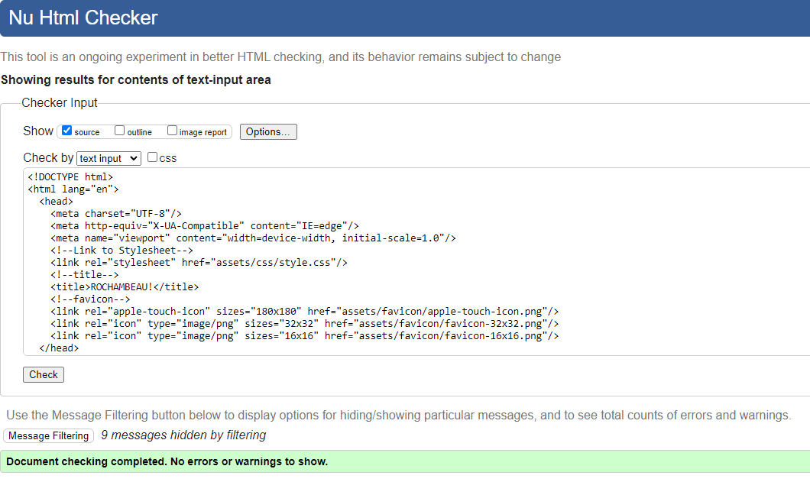

# Project 2 - ROCHAMBEAU! TESTING

## Contents
- [Automated Testing](#automated-testing)
    - [W3C Validator](#w3c-validator)
- [Manual Testing](#manual-testing)
- [Bugs](#bugs)

## Automated Testing

### W3C Validator
####  *HTML*

W3C was used to validate the HTML of the ROCHAMBEAU! site. I  checked the HTML via direct input and also by copying the page source and running these through the validator.

*several info messages popped up these are caused by the formatting and are unable to be removed.
---

#### *CSS*
CSS Validation can only be done by copying and pasting the CSS file contents into the direct input.

---

### Lighthouse

Lighthouse was used which is found within the Chrome Developer Tools to allow me to test the performance, accessibility and SEO of the website.

 ---

### Wave

---
## Manual testing

Some of the website functions needed to be tested manually, such as links around the page or the functionality and responsivness of added features. 

### Devices Used

| Device  | Name/ Size of Sevice| 
|---------|---------------|
| Desktop | 1920 x 1080 |
| Laptop  | 1366 x 768 |
| Tablet | Apple iPad Pro |
| Mobile | Apple iPhone 13 Pro Max 128GB |

### Browsers Used
Google Chrome
Safari

#### Desktop (1920 x 1080)
#### Browser (Google Chrome)

| Feature            | Expected Outcome                                                     | Testing Performed                   | Result                    | Pass/Fail |
| -------------------| ---------------------------------------------------------------------| ----------------------------------- | --------------------------| --------- |
| Menu Modal         |                                                                      |                                     |                           |           |
| Menu Modal         | When the page loads is this the first thing you                      | Load the site                       |  When the page loads is this the first thing you                          | Pass      |
| Easy Button        | Close Menu Modal, Launch Game in Easy Mode (no lizard or spock)      | Click Easy Button                   | Close Menu Modal, Launch Game in Easy Mode (no lizard or spock)                           | Pass      |
| Hard Button        | Close Menu Modal, Launch Game in Hard Mode (All choices available)   | Click Hard Button                   | Close Menu Modal, Launch Game in Hard Mode (All choices available)                           | Pass      |
| Rules Button       | Open Rules Modal                                                     | Click Rules Button                  | Open Rules Modal                           | Pass      |
| Close Rules Button | Close Rules Modal                                                    | Click Cross Button on Rules Modal   | Close Rules Modal                             | Pass      |
| Lives Button       | Open Lives Modal                                                     | Click Lives Button                  | Open Lives Modal                           | Pass      |
| Lives Modal        |                                                                      |                                     |                           |           |
| Lives slider       | Move the range on the slider to three distinct stops                 | Move the range finder on the slider |  Move the range on the slider to three distinct stop                          | Pass      |
| Lives slider value | The Value of the Lives should change as the slider reaches each stop | Move the range finder on the slider | The Value of the Lives should change as the slider reaches each stop                          | Pass      |
| Easy Button (Lives)| Close Lives Modal, Launch Game in Easy Mode (no lizard or spock) With selected number of lives| Click Easy Button in the Lives Modal | Close Lives Modal, Launch Game in Easy Mode (no lizard or spock) With selected number of lives                          | Pass           |
| Hard Button (Lives)| Close Lives Modal, Launch Game in Hard Mode (All choices available) With selected number of lives| Click Hard Button in the Lives | lose Lives Modal, Launch Game in Hard Mode (All choices available) With selected number of lives                           | Pass           |
| Menu Button       | Closes the Lives Modal, Opens the Menu Modal                          | Click Menu button in Lives Modal    | Closes the Lives Modal, Opens the Menu Modal                          | Pass      |
| Game Screen       |                                                                       |                                     |                           |           |
| Player Choices    |                                                                       |                                     |                           |           |
| Rock Button       | Causes a result to come up                                            | Click Rock Button                   | Causes a result to come up                          | Pass      |
| Paper Button      | Causes a result to come up                                            | Click Paper Button                  | Causes a result to come up                          | Pass      |
| Scissors Button   | Causes a result to come up                                            | Click Scissors Button               | Causes a result to come up                         | Pass      |
| Lizard Button     | Causes a result to come up                                            | Click Lizard Button                 | Causes a result to come up                          | Pass      |
| Spock Button      | Causes a result to come up                                            | Click Spock Button                  | Causes a result to come up                          | Pass      |
| Player Lives      | Lives stays the same on a win and a tie, lives decrease on a lose     | Play a round of the game            | Lives stays the same on a win and a tie, lives decrease on a lose                           | Pass      |
| Computer Lives    | Lives stays the same on a win and a tie, lives decrease on a lose     | Play a round of the game            | Lives stays the same on a win and a tie, lives decrease on a lose                          | Pass      |
| Menu Button       | Closes the Lives Modal, Opens the Menu Modal                          | Click Menu button on the game screen|  Closes the Lives Modal, Opens the Menu Modal                           | Pass      |
| Rules Button      | Open Rules Modal                                                      | Click Rules button on the game screen| Open Rules Modal                         | Pass      |
| Game Over Modal   |                                                                       |                                     |                           |           |
| Win Message       | Once the computer runs out of lives the You Win Message will appear   | complete a game with a win          |Once the computer runs out of lives the You Win Message will appear                           | Pass      |
| Lose Message      | Once the computer runs out of lives the You Lose Message will appear  |   complete a game with a Lose       |Once the computer runs out of lives the You Lose Message will appear                           | Pass      |
| Menu Button       | Closes the Game Over Modal, Opens the Menu Modal                      | Click Menu button on the Game Over Modal|  Closes the Game Over Modal, Opens the Menu Modal                      | Pass      |  

#### Laptop (1366 x 768)
#### Browser (Google Chrome)
| Feature            | Expected Outcome                                                     | Testing Performed                   | Result                    | Pass/Fail |
| -------------------| ---------------------------------------------------------------------| ----------------------------------- | --------------------------| --------- |
| Menu Modal         |                                                                      |                                     |                           |           |
| Menu Modal         | When the page loads is this the first thing you                      | Load the site                       |  When the page loads is this the first thing you                          | Pass      |
| Easy Button        | Close Menu Modal, Launch Game in Easy Mode (no lizard or spock)      | Click Easy Button                   | Close Menu Modal, Launch Game in Easy Mode (no lizard or spock)                           | Pass      |
| Hard Button        | Close Menu Modal, Launch Game in Hard Mode (All choices available)   | Click Hard Button                   | Close Menu Modal, Launch Game in Hard Mode (All choices available)                           | Pass      |
| Rules Button       | Open Rules Modal                                                     | Click Rules Button                  | Open Rules Modal                           | Pass      |
| Close Rules Button | Close Rules Modal                                                    | Click Cross Button on Rules Modal   | Close Rules Modal                             | Pass      |
| Lives Button       | Open Lives Modal                                                     | Click Lives Button                  | Open Lives Modal                           | Pass      |
| Lives Modal        |                                                                      |                                     |                           |           |
| Lives slider       | Move the range on the slider to three distinct stops                 | Move the range finder on the slider |  Move the range on the slider to three distinct stop                          | Pass      |
| Lives slider value | The Value of the Lives should change as the slider reaches each stop | Move the range finder on the slider | The Value of the Lives should change as the slider reaches each stop                          | Pass      |
| Easy Button (Lives)| Close Lives Modal, Launch Game in Easy Mode (no lizard or spock) With selected number of lives| Click Easy Button in the Lives Modal | Close Lives Modal, Launch Game in Easy Mode (no lizard or spock) With selected number of lives                          | Pass           |
| Hard Button (Lives)| Close Lives Modal, Launch Game in Hard Mode (All choices available) With selected number of lives| Click Hard Button in the Lives | lose Lives Modal, Launch Game in Hard Mode (All choices available) With selected number of lives                           | Pass           |
| Menu Button       | Closes the Lives Modal, Opens the Menu Modal                          | Click Menu button in Lives Modal    | Closes the Lives Modal, Opens the Menu Modal                          | Pass      |
| Game Screen       |                                                                       |                                     |                           |           |
| Player Choices    |                                                                       |                                     |                           |           |
| Rock Button       | Causes a result to come up                                            | Click Rock Button                   | Causes a result to come up                          | Pass      |
| Paper Button      | Causes a result to come up                                            | Click Paper Button                  | Causes a result to come up                          | Pass      |
| Scissors Button   | Causes a result to come up                                            | Click Scissors Button               | Causes a result to come up                         | Pass      |
| Lizard Button     | Causes a result to come up                                            | Click Lizard Button                 | Causes a result to come up                          | Pass      |
| Spock Button      | Causes a result to come up                                            | Click Spock Button                  | Causes a result to come up                          | Pass      |
| Player Lives      | Lives stays the same on a win and a tie, lives decrease on a lose     | Play a round of the game            | Lives stays the same on a win and a tie, lives decrease on a lose                           | Pass      |
| Computer Lives    | Lives stays the same on a win and a tie, lives decrease on a lose     | Play a round of the game            | Lives stays the same on a win and a tie, lives decrease on a lose                          | Pass      |
| Menu Button       | Closes the Lives Modal, Opens the Menu Modal                          | Click Menu button on the game screen|  Closes the Lives Modal, Opens the Menu Modal                           | Pass      |
| Rules Button      | Open Rules Modal                                                      | Click Rules button on the game screen| Open Rules Modal                         | Pass      |
| Game Over Modal   |                                                                       |                                     |                           |           |
| Win Message       | Once the computer runs out of lives the You Win Message will appear   | complete a game with a win          |Once the computer runs out of lives the You Win Message will appear                           | Pass      |
| Lose Message      | Once the computer runs out of lives the You Lose Message will appear  |   complete a game with a Lose       |Once the computer runs out of lives the You Lose Message will appear                           | Pass      |
| Menu Button       | Closes the Game Over Modal, Opens the Menu Modal                      | Click Menu button on the Game Over Modal|  Closes the Game Over Modal, Opens the Menu Modal                      | Pass      |  

#### Tablet (Apple iPad Pro)
#### Browser (Safari)
| Feature            | Expected Outcome                                                     | Testing Performed                   | Result                    | Pass/Fail |
| -------------------| ---------------------------------------------------------------------| ----------------------------------- | --------------------------| --------- |
| Menu Modal         |                                                                      |                                     |                           |           |
| Menu Modal         | When the page loads is this the first thing you                      | Load the site                       |                           |           |
| Easy Button        | Close Menu Modal, Launch Game in Easy Mode (no lizard or spock)      | Click Easy Button                   |                           |           |
| Hard Button        | Close Menu Modal, Launch Game in Hard Mode (All choices available)   | Click Hard Button                   |                           |           |
| Rules Button       | Open Rules Modal                                                     | Click Rules Button                  |                           |           |
| Close Rules Button | Close Rules Modal                                                    | Click Cross Button on Rules Modal   |                           |           |
| Lives Button       | Open Lives Modal                                                     | Click Lives Button                  |                           |           |
| Lives Modal        |                                                                      |                                     |                           |           |
| Lives slider       | Move the range on the slider to three distinct stops                 | Move the range finder on the slider |                           |           |
| Lives slider value | The Value of the Lives should change as the slider reaches each stop | Move the range finder on the slider |                           |           |
| Easy Button (Lives)| Close Lives Modal, Launch Game in Easy Mode (no lizard or spock) With selected number of lives| Click Easy Button in the Lives Modal |                           |           |
| Hard Button (Lives)| Close Lives Modal, Launch Game in Hard Mode (All choices available) With selected number of lives| Click Hard Button in the Lives |                           |           |
| Menu Button       | Closes the Lives Modal, Opens the Menu Modal                          | Click Menu button in Lives Modal    |                           |            |
| Game Screen       |                                                                       |                                     |                           |            |
| Player Choices    |                                                                       |                                     |                           |            |
| Rock Button       | Causes a result to come up                                            | Click Rock Button                   |                           |            |
| Paper Button      | Causes a result to come up                                            | Click Paper Button                  |                           |            |
| Scissors Button   | Causes a result to come up                                            | Click Scissors Button               |                           |            |
| Lizard Button     | Causes a result to come up                                            | Click Lizard Button                 |                           |            |
| Spock Button      | Causes a result to come up                                            | Click Spock Button                  |                           |            |
| Player Lives      | Lives stays the same on a win and a tie, lives decrease on a lose     | Play a round of the game            |                           |            |
| Computer Lives    | Lives stays the same on a win and a tie, lives decrease on a lose     | Play a round of the game            |                           |            |
| Menu Button       | Closes the Lives Modal, Opens the Menu Modal                          | Click Menu button on the game screen|                           |            |
| Rules Button      | Open Rules Modal                                                      | Click Rules button on the game screen|                          |            |
| Game Over Modal   |                                                                       |                                     |                           |            |
| Win Message       | Once the computer runs out of lives the You Win Message will appear   | complete a game with a win          |                           |            |
| Lose Message      | Once the computer runs out of lives the You Lose Message will appear  |   complete a game with a Lose       |                           |            |
| Menu Button       | Closes the Game Over Modal, Opens the Menu Modal                      | Click Menu button on the Game Over Modal|                       |            |  

#### Mobile (Apple iPhone 13 Pro Max 128GB)
#### Browser (Safari) 
| Feature            | Expected Outcome                                                     | Testing Performed                   | Result                    | Pass/Fail |
| -------------------| ---------------------------------------------------------------------| ----------------------------------- | --------------------------| --------- |
| Menu Modal         |                                                                      |                                     |                           |           |
| Menu Modal         | When the page loads is this the first thing you                      | Load the site                       |  When the page loads is this the first thing you                          | Pass      |
| Easy Button        | Close Menu Modal, Launch Game in Easy Mode (no lizard or spock)      | Click Easy Button                   | Close Menu Modal, Launch Game in Easy Mode (no lizard or spock)                           | Pass      |
| Hard Button        | Close Menu Modal, Launch Game in Hard Mode (All choices available)   | Click Hard Button                   | Close Menu Modal, Launch Game in Hard Mode (All choices available)                           | Pass      |
| Rules Button       | Open Rules Modal                                                     | Click Rules Button                  | Open Rules Modal                           | Pass      |
| Close Rules Button | Close Rules Modal                                                    | Click Cross Button on Rules Modal   | Close Rules Modal                             | Pass      |
| Lives Button       | Open Lives Modal                                                     | Click Lives Button                  | Open Lives Modal                           | Pass      |
| Lives Modal        |                                                                      |                                     |                           |           |
| Lives slider       | Move the range on the slider to three distinct stops                 | Move the range finder on the slider |  Move the range on the slider to three distinct stop                          | Pass      |
| Lives slider value | The Value of the Lives should change as the slider reaches each stop | Move the range finder on the slider | The Value of the Lives should change as the slider reaches each stop                          | Pass      |
| Easy Button (Lives)| Close Lives Modal, Launch Game in Easy Mode (no lizard or spock) With selected number of lives| Click Easy Button in the Lives Modal | Close Lives Modal, Launch Game in Easy Mode (no lizard or spock) With selected number of lives                          | Pass           |
| Hard Button (Lives)| Close Lives Modal, Launch Game in Hard Mode (All choices available) With selected number of lives| Click Hard Button in the Lives | lose Lives Modal, Launch Game in Hard Mode (All choices available) With selected number of lives                           | Pass           |
| Menu Button       | Closes the Lives Modal, Opens the Menu Modal                          | Click Menu button in Lives Modal    | Closes the Lives Modal, Opens the Menu Modal                          | Pass      |
| Game Screen       |                                                                       |                                     |                           |           |
| Player Choices    |                                                                       |                                     |                           |           |
| Rock Button       | Causes a result to come up                                            | Click Rock Button                   | Causes a result to come up                          | Pass      |
| Paper Button      | Causes a result to come up                                            | Click Paper Button                  | Causes a result to come up                          | Pass      |
| Scissors Button   | Causes a result to come up                                            | Click Scissors Button               | Causes a result to come up                         | Pass      |
| Lizard Button     | Causes a result to come up                                            | Click Lizard Button                 | Causes a result to come up                          | Pass      |
| Spock Button      | Causes a result to come up                                            | Click Spock Button                  | Causes a result to come up                          | Pass      |
| Player Lives      | Lives stays the same on a win and a tie, lives decrease on a lose     | Play a round of the game            | Lives stays the same on a win and a tie, lives decrease on a lose                           | Pass      |
| Computer Lives    | Lives stays the same on a win and a tie, lives decrease on a lose     | Play a round of the game            | Lives stays the same on a win and a tie, lives decrease on a lose                          | Pass      |
| Menu Button       | Closes the Lives Modal, Opens the Menu Modal                          | Click Menu button on the game screen|  Closes the Lives Modal, Opens the Menu Modal                           | Pass      |
| Rules Button      | Open Rules Modal                                                      | Click Rules button on the game screen| Open Rules Modal                         | Pass      |
| Game Over Modal   |                                                                       |                                     |                           |           |
| Win Message       | Once the computer runs out of lives the You Win Message will appear   | complete a game with a win          |Once the computer runs out of lives the You Win Message will appear                           | Pass      |
| Lose Message      | Once the computer runs out of lives the You Lose Message will appear  |   complete a game with a Lose       |Once the computer runs out of lives the You Lose Message will appear                           | Pass      |
| Menu Button       | Closes the Game Over Modal, Opens the Menu Modal                      | Click Menu button on the Game Over Modal|  Closes the Game Over Modal, Opens the Menu Modal                      | Pass      |    

---

### Bugs

#### Fixed Bugs

|               Bug               |                How I fixed it                      |
|---------------------------------|----------------------------------------------------|     
| All Rules Buttons opening the  Menu modal on closing  | Simplified code for the Rule Modal Function  |
| Spock and Lizard Button Icons not aligning | Removed padding from parent container element  | 
| Launching game from menu modal and from lives modal were launching the game with different amount of lives | found duplicated code giving varying information, code removed and checked |

#### Known bugs
There are no known bugs still existing at this time.
